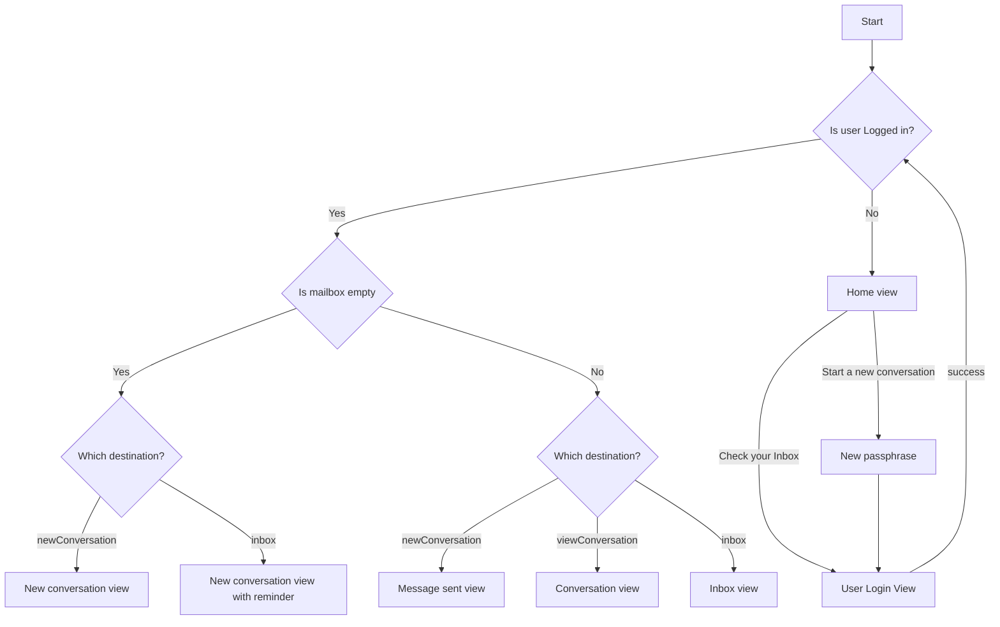

# CoverDropUserInterface

This package contains all the user interface classes for the CoverDrop iOS application.
This will allow you to import this package into your application and get the full functionality
of CoverDrop within your application.

This currently has two views:

- `JournalistListView` which displays a list of journalists that you can contact
- `JournalistMessageView` which is the interface to message a journalist

There are a few additional steps required when integrating this library:

1. Integrate the Coverdrop implementation or equivalents of all available `UIApplicationDelegate` system callback methods. These include:

```
    public static func application(_ application: UIApplication, shouldAllowExtensionPointIdentifier extensionPointIdentifier: UIApplication.ExtensionPointIdentifier) -> Bool

    public static func application(_ application: UIApplication, didFinishLaunchingWithOptions launchOptions: [UIApplication.LaunchOptionsKey: Any]?)

    public static func applicationDidEnterBackground(_ window: UIWindow?, coverProvider: AppSwitchingCoverProvider

    public static func applicationWillEnterForeground(coverProvider: AppSwitchingCoverProvider)

```

Note that the `AppSwitchingCoverProvider` protocol will need to be implemented from the host app to provide a custom privacy cover view to suit your app's branding.

## Navigation

We follow a stateful approach to rendering most views as their visibility depends on various user parameters
For the entry point into the application `StartCoverDropSessionView` is only rendered if the user not logged in.
Once the user logs in we render the `InboxStateView`, this renders the inbox if there are messages in the users mailbox, or the new message view if there are no messages yet. If the user has selected a recipient then the chat view is displayed.


